# Maptemberに行って来た
## Georepublic Japan
## 長瀬 興

---
## 今日のお題
* 自己紹介
* Maptemberとは
* State of the Map 2013 参考リンク紹介など
* QGIS Hack Fest 2013 参加報告
* FOSS4G Nottingham 2013 参加報告

※今回の発表は個人の感想です。

---

今回のプレゼンテーションは以下にアップロードします

http://sanak.github.io/presentation/maptember_foss4g2013osaka/

---

# 自己紹介

---
## Georepublic Japan デベロッパ
* GISエンジニア
* スマートフォンアプリ開発見習い
* Webアプリケーション開発見習い
* 開発言語
    * C++/C#(元はWindows系)
    * Objective-C/Java(中程度)
    * JavaScript(中程度 GIS系ではOpenLayers/GeoExt)
    * Python/Ruby/ShellScript(ほんの少し)

---
## オープンソース関係の活動
GitHub: https://github.com/sanak

* pgRouting デベロッパ
* QGIS pgRoutingLayer プラグイン コントリビュータ
* QGIS (本体組み込みのfToolsプラグインについて1行だけコントリビュート...)

---

# Maptember

---

## Maptemberとは
9月(September)にイギリスで地理情報系のイベントが集中

URL: http://www.maptember.org/

* 09/06 - 09/08: State of the Map 2013
* 09/16 - 09/18: AGI GeoCommunity '13
* 09/17 - 09/21: FOSS4G Nottingham 2013

同時期に、QGISの開発者イベントも開催

* 09/12 - 09/16: 10th QGIS Developer Meeting

---

# State of the Map 2013

---

## SOTM 2013
URL: http://2013.stateofthemap.org/

* OpenStreetMapの年1回の国際カンファレンス
    * 昨年は日本で開催
    * 日本人が8名参加
* 技術的な話からマッパー向け情報まで盛りだくさん
* 弊社からは松澤が参加(LT[映像(MP4直リンク)](http://osm.won2.de/sotm/d3t1-1640-VA-LIGHTNING_TALKS_2.mp4), [資料](http://smellman.github.io/presentation/find_a_hidden_river/index.html))

---

## 映像など

映像は全てオンラインで公開されています

* [OpenStreetMap Foundation - Civico Live](http://citizen.civico.net/openstreetmapfoundation)

これはでかすぎるので分割したものを公開してる人がいます

* [Videos of SOTM2013](http://osm.won2.de/sotm/)

興味のある人は後者からピンポイントで見るのがオススメ

---

# 10th QGIS Developer Meeting

---
URL: http://hub.qgis.org/wiki/17/10_QGIS_Developer_Meeting_in_Brighton_2013

* QGISの第10回ハックイベント
    * 日本からは、Matteo Gismondiさん(アジア航測株式会社)、嘉山さん(朝日航洋株式会社)、関・松澤・長瀬(Georepublic Japan)が参加
* QGIS 2.0リリース直後
* 4日間部屋を借りてひたすらコーディングとかドキュメントの作成

---

初日(9/12)
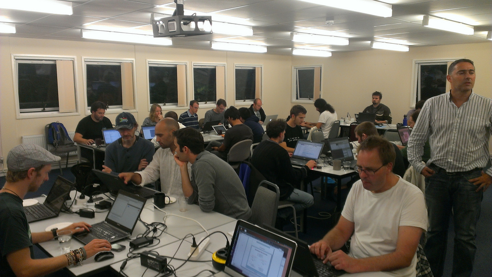

http://www.flickr.com/photos/48244569@N02/9930323365/in/pool-2286344@N25

---

2日目(9/13)
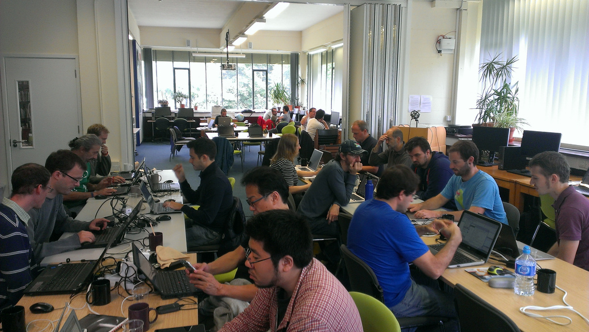

http://www.flickr.com/photos/48244569@N02/9930490233/in/pool-2286344@N25

---

3日目(9/14) - 夕食
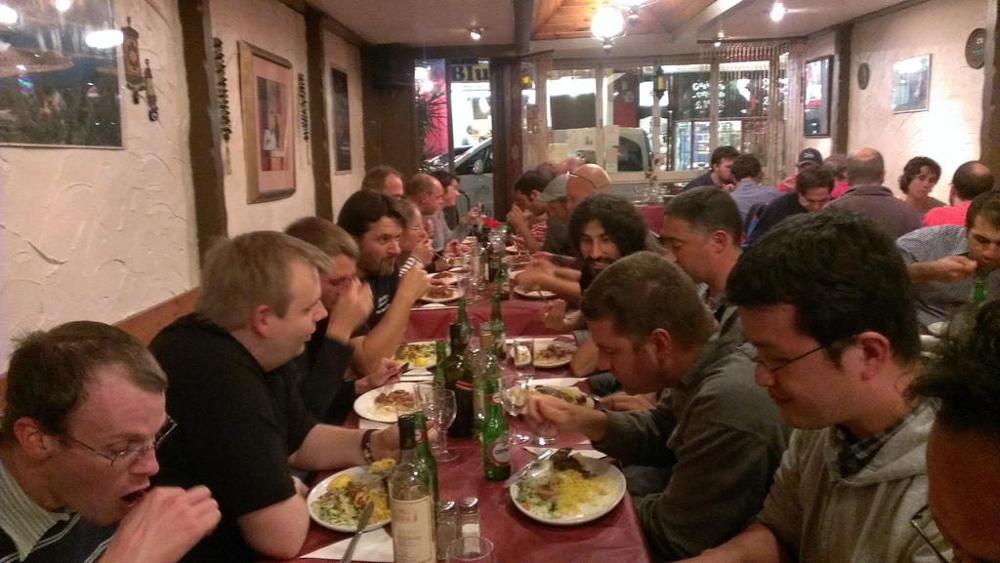

http://www.flickr.com/photos/48244569@N02/9930608133/in/pool-2286344@N25

---

4日目(9/15) - 集合写真
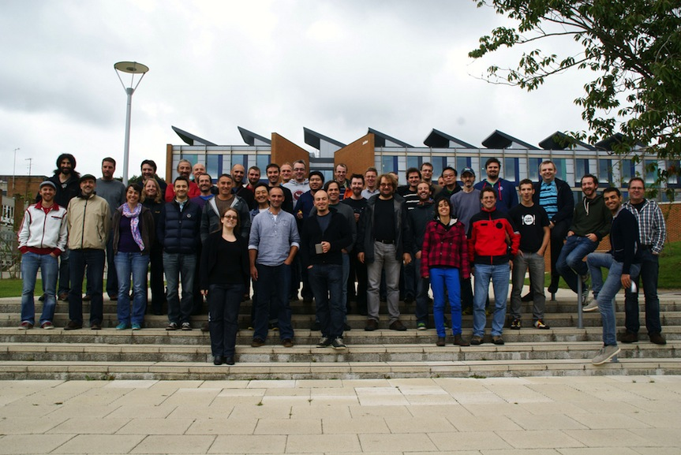

http://www.flickr.com/photos/48244569@N02/9921690826/in/pool-2286344@N25

---

FOSS4G2013開催地への移動日(9/16)
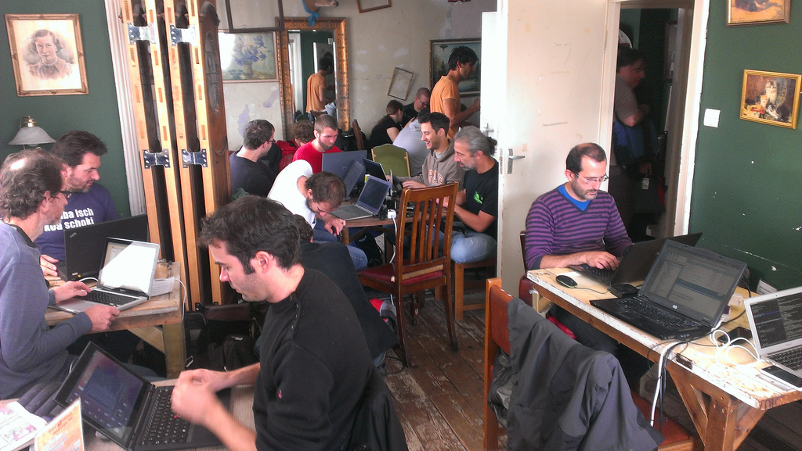

http://www.flickr.com/photos/48244569@N02/9930655603/in/pool-2286344@N25

---

## プログラム
* こういうテーマで話するよーって言って適当に隣の部屋に集まって話をする
    * QGISのQMLや3D機能、モバイルクライアントといった意欲的な取り組みについて参加者がプレゼン
    * Tim Suttonを中心として、本体に取り込む場合の課題などについてツッコミが入る

---

## 感想
* かなり込み入った話ができ、多くの物事が進む
    * 新しいQGISのWebページの翻訳
    * 翻訳のワークフローをTransifexに統一
* 食事や会場のファシリティがすごく良かった
    * 日本でも参考にしたい
* 個人的には...
    * QGISの開発者を間近で見ることができて、開発に対するモチベーションは向上
    * 途中参加であまり貢献できなかったので、これから何とか貢献していきたい...

---

# FOSS4G Nottingham 2013

---

URL: http://2013.foss4g.org/

* オープンソースのジオ系開発者・ユーザー・リーダーの年1回の集まり
* ワークショップ: 28セッション
* プレゼンテーション: 180
* 参加者: 833人

---

## ワークショップ・GeoHack(1-2日目)
1日目のpgRoutingワークショップにアシスタントとして参加

**FOSS4G routing with pgRouting, OpenStreetMap road data and OpenLayers 3**

講師:

* Hal Seki (CEO of Genrepublic Japan)
* Yves Jacolin (Camptocamp)

教材: http://workshop.pgrouting.org

教材(日本語): http://workshop.pgrouting.org/ja

---

pgRoutingワークショップの様子(参加者55名)
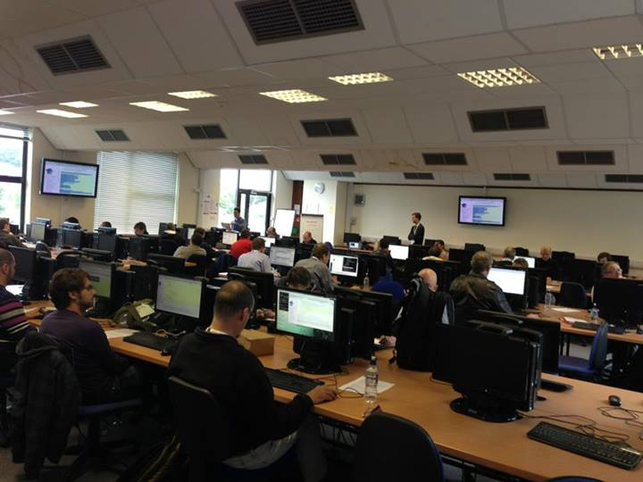

---

## コアデイ(3-5日目)
会場に全員(約800人)が集い、本格的なイベントが始まる
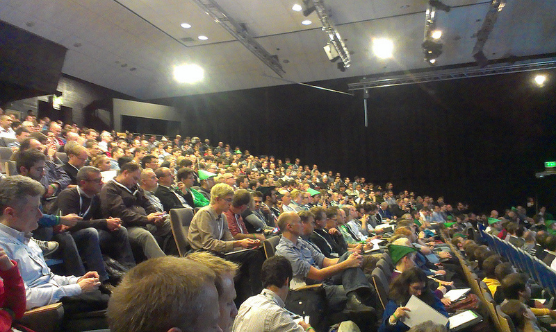
http://www.flickr.com/photos/chippee/9905655846/in/pool-foss4g/

---

オープニング中はダンスなども始まってお祭りの雰囲気が盛り上がる
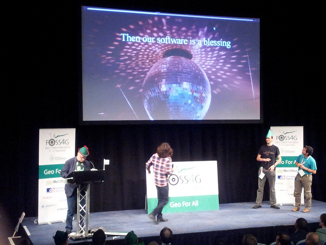
http://www.flickr.com/photos/103480088@N06/9966658994/in/pool-foss4g

---

## 歩く
* キャンパス内の二つの建物(メイン会場:6部屋、別会場:3部屋)でプレゼンテーションが行われる
* 見たいセッションごとに、キャンパスを移動

---

だいたい徒歩10分ぐらいかかる

---

## プレゼンテーション・キーノート - 1日目

---

Boost.Geometry, Introduction And Examples
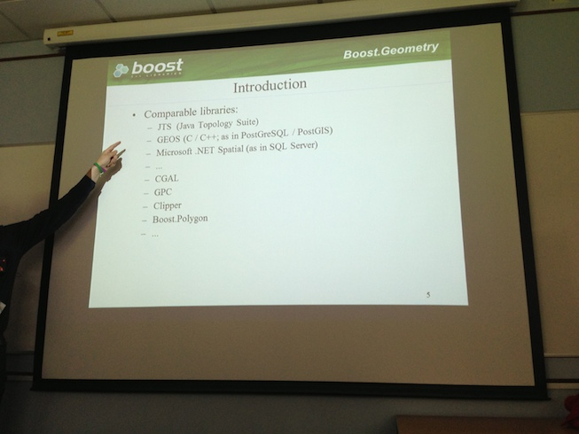
http://www.youtube.com/watch?v=mFXD8xSXzxI&list=PLWW0CjV-TafaBjkroiOxcQw8NdOQ_fhu2&index=74

---

Shortest Path Search with pgRouting

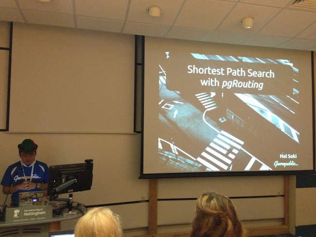

※本日、午後から弊社のDanielが同じ内容で発表します。

---

OSGeoLive 7.0

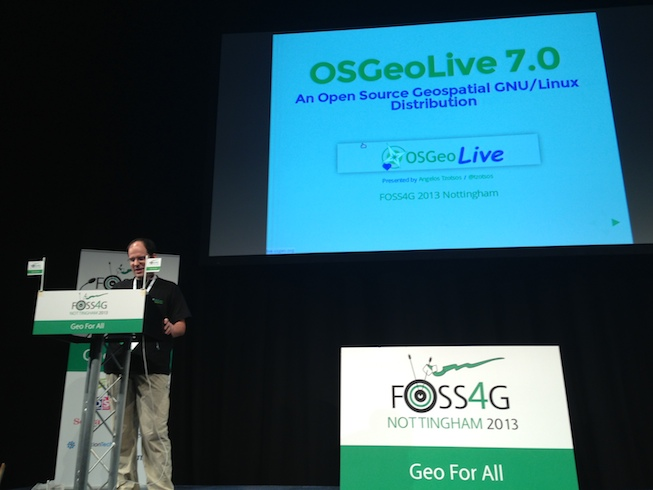

---

## プレゼンテーション・キーノート - 2日目

---

A New Dimension To PostGIS : 3D

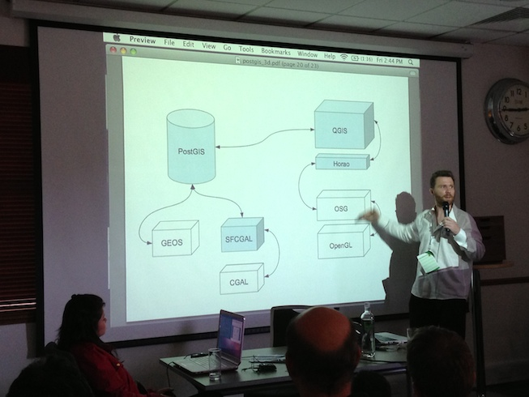

http://www.youtube.com/watch?v=tQbE6B8JaHI&list=PLWW0CjV-TafaBjkroiOxcQw8NdOQ_fhu2&index=38

---

QGIS - Tim Suttom

---

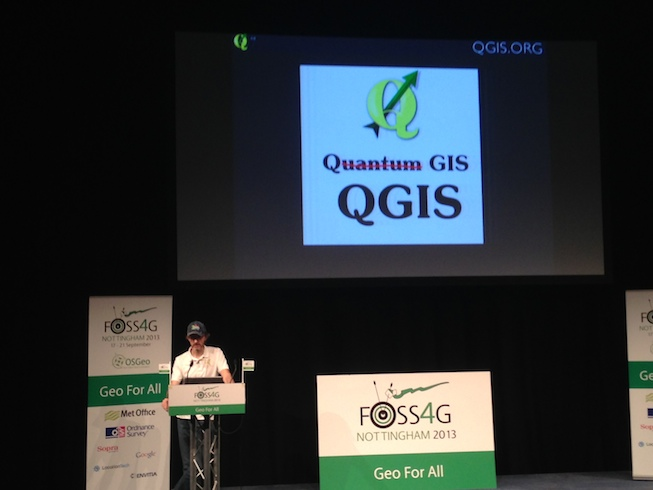

---

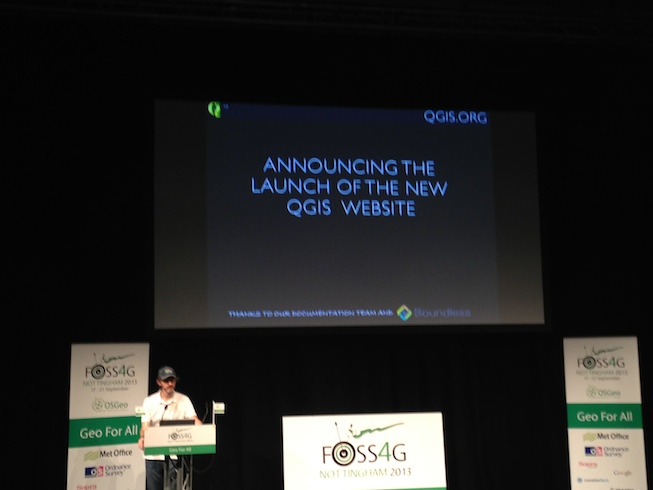

---

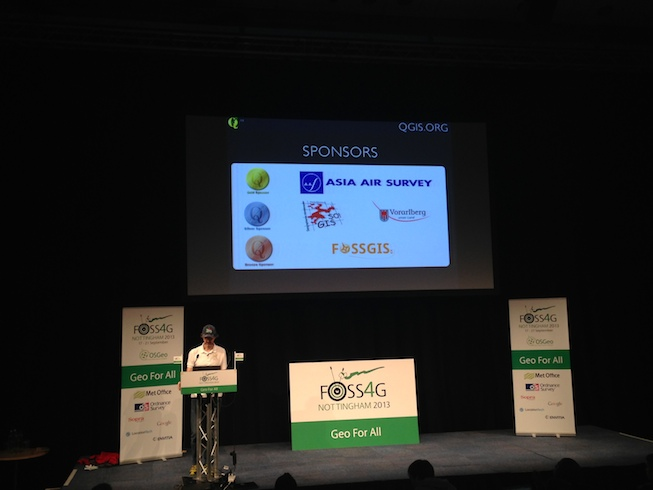

---

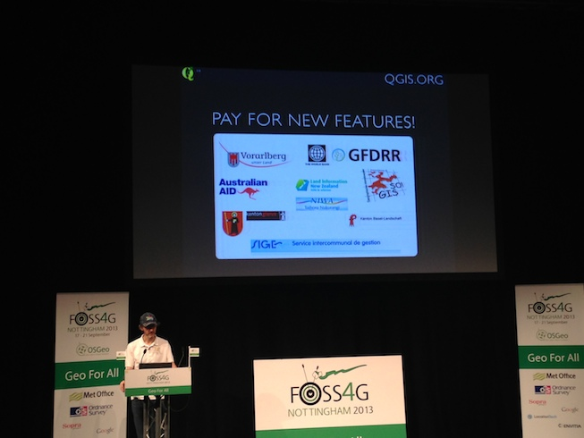

---

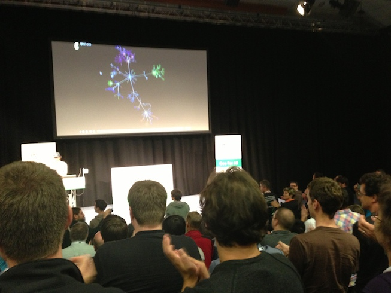

---

## プレゼンテーション・キーノート - 3日目

---

SVG Map - Tile Map Without Javascript
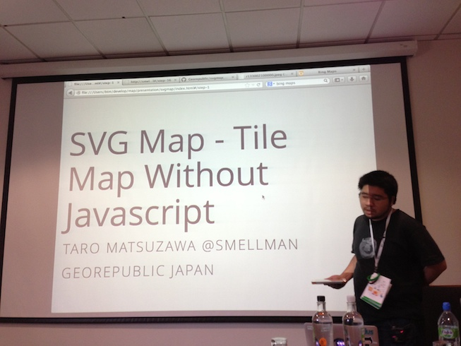
http://www.youtube.com/watch?v=kOx7GpEqsfc&list=PLWW0CjV-TafaBjkroiOxcQw8NdOQ_fhu2&index=1

---

OpenLayers 3: Under The Hood
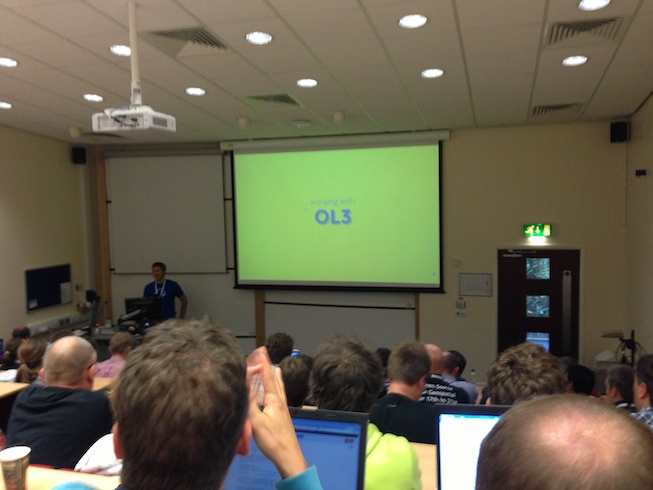
http://www.youtube.com/watch?v=dCAq1UHRjUg&list=PLWW0CjV-TafaBjkroiOxcQw8NdOQ_fhu2&index=11

---

Ordnance Surveyの方のキーノート

---

## その他の映像など

Youtubeにプレゼンテーションがアップされている。

* [FOSS4G13 - Youtube](http://www.youtube.com/playlist?list=PLWW0CjV-TafaBjkroiOxcQw8NdOQ_fhu2)

ただし、プレゼンターの画面と音声となっているのと、全てのプレゼンテーションが含まれているわけではない。

---

# まとめ

---

* ビジュアリゼーション(3D、時系列表示など)にシフトしてきている
* QGISが2.0リリースと同時に、大きな潮流に
* 英国のホスピタリティ(おもてなしの心)に感動

---

ご清聴ありがとうございました

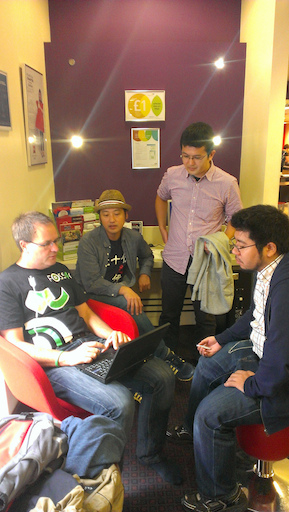
